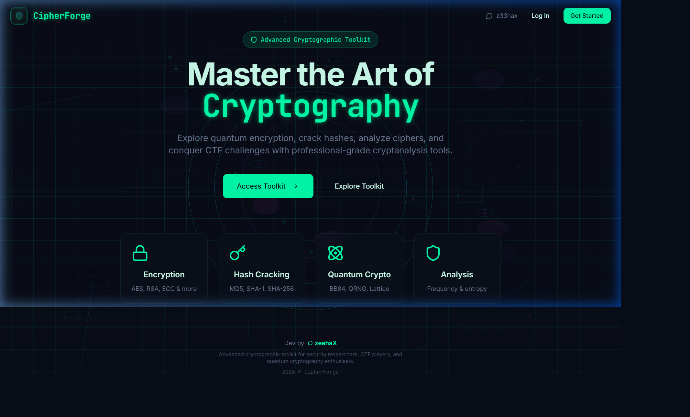
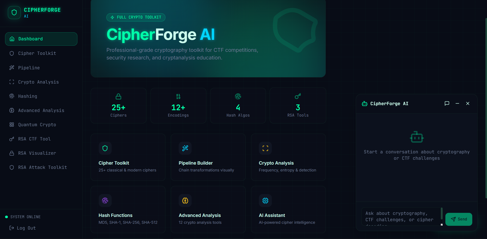
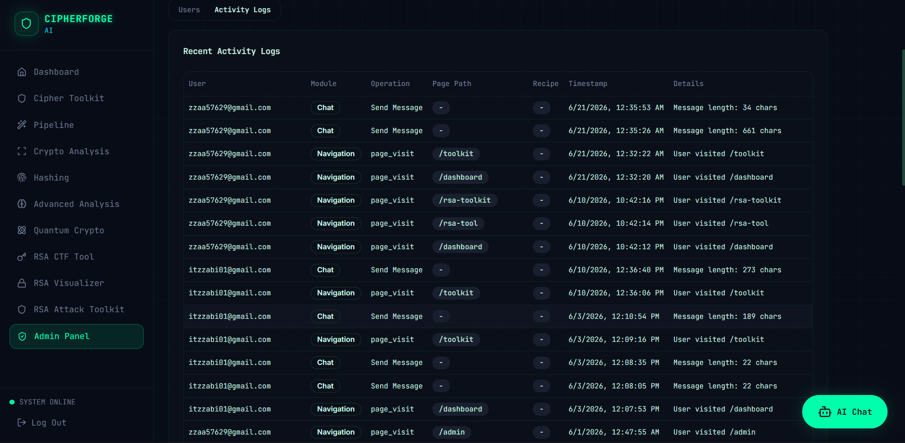

```
 ██████╗██╗██████╗ ██╗  ██╗██████╗ ██████╗
██╔════╝██║██╔══██╗██║  ██║╚════██╗██╔══██╗
██║     ██║██████╔╝███████║ █████╔╝██████╔╝
██║     ██║██╔═══╝ ██╔══██║ ╚═══██╗██╔══██╗
╚██████╗██║██║     ██║  ██║██████╔╝██║  ██║
 ╚═════╝╚═╝╚═╝     ╚═╝  ╚═╝╚═════╝ ╚═╝  ╚═╝

███████╗ ██████╗ ██████╗  ██████╗ ███████╗
██╔════╝██╔═══██╗██╔══██╗██╔════╝ ██╔════╝
█████╗  ██║   ██║██████╔╝██║  ███╗█████╗
██╔══╝  ██║   ██║██╔══██╗██║   ██║██╔══╝
██║     ╚██████╔╝██║  ██║╚██████╔╝███████╗
╚═╝      ╚═════╝ ╚═╝  ╚═╝ ╚═════╝ ╚══════╝
```

<div align="center">

### Advanced Cryptographic Toolkit & CTF Playground

Encrypt, decrypt, crack, and visualize — a full-stack cryptography workbench for classical ciphers, modern hashing, RSA/ECC/Diffie-Hellman, and post-quantum concepts.

[](https://ciph3r-forge.base44.app/)

[](https://react.dev)
[](https://vitejs.dev)
[](https://tailwindcss.com)
[](https://base44.com)
[](https://base44.com)
[](#license)

**[🚀 Try it live → ciph3r-forge.base44.app](https://ciph3r-forge.base44.app/)**

</div>

---



## About

**Ciph3r Forge** is a browser-based cryptanalysis toolkit — cipher tools, hash cracking, and RSA/ECC/Diffie-Hellman visualizers in a dark, terminal-inspired UI.

> ⚡ Fully vibe-coded on **[Base44](https://base44.com)** — prompt-engineered from concept to production. Base44 powers the backend: auth, database, serverless functions, and the in-app AI assistant.

## Features

| Module | Description |
|---|---|
| 🔐 **Cipher Toolkit** | Caesar, Vigenère, Affine, Rail Fence, Columnar Transposition, Beaufort, XOR, Bacon, Polybius, ROT13/47, and more — encode, decode & brute-force |
| 🧬 **Pipeline** | Chain multiple cipher/encoding operations into a reusable recipe |
| 🔎 **Crypto Analysis** | Frequency analysis, Index of Coincidence (IOC), entropy analysis, KDF detection |
| 🧾 **Hashing** | Generate MD5/SHA-1/SHA-256/SHA-512/HMAC digests, identify unknown hash formats, and attempt cracking (online lookups, common passwords, dictionary & brute-force attacks) |
| 🔑 **RSA Suite** | RSA CTF tool, key visualizer, and an attack toolkit (common factorization/weak-key attacks) |
| 🌀 **ECC & Diffie-Hellman** | Interactive elliptic-curve and key-exchange visualizers, including a MITM demo |
| ⚛️ **Quantum Crypto** | BB84 quantum key distribution simulation, QRNG demo, lattice-based crypto primer |
| 🤖 **AI Assistant** | Floating chat assistant (Base44-hosted LLM) for on-demand crypto Q&A |
| 🛡️ **Admin Panel** | User management, activity logs, and chat-usage limits (role-gated) |

## Tech Stack

**Frontend**
- React 18 + Vite 6
- React Router v6
- Tailwind CSS 3 + shadcn/ui (Radix primitives)
- TanStack Query for data fetching/caching
- Framer Motion for animation
- Recharts / Three.js for visualizations
- JetBrains Mono + Inter typography, custom dark "cyber" theme

**Backend — Base44**
- Managed authentication (email/password, session tokens)
- Entity database with schema + row-level security (RLS) defined per entity (`User`, `Submission`, `UserProgress`, `ChatHistory`, `UserActivityLog`, `UserChatLimit`, `CTFChallenge`)
- Serverless functions (Deno) for hash identification, hash cracking, and activity logging
- Built-in AI model integration powering the in-app chat assistant

## Project Structure

```
ciph3r-forge/
├── src/
│   ├── components/         # UI primitives (shadcn/ui) + feature components
│   │   ├── analysis/       # Per-tool analysis widgets (AES, RSA, ECC, HMAC, IOC, entropy...)
│   │   ├── crypto/         # Shared cipher input/output components
│   │   └── chat/           # Floating AI assistant
│   ├── lib/
│   │   ├── ciphers/        # Core cipher/encoding/hashing/analysis logic
│   │   ├── AuthContext.jsx # Base44 auth state provider
│   │   └── ctfChallenges.js# CTF challenge definitions
│   ├── pages/               # Route-level pages (Dashboard, Toolkit, Hashing, RSA*, Admin, etc.)
│   └── api/base44Client.js  # Base44 SDK client
├── base44/
│   ├── entities/            # Entity schemas + RLS policy definitions (.jsonc)
│   └── functions/           # Serverless backend functions (crackHash, identifyHash, getAllUsers, logUserActivity)
└── vite.config.js / tailwind.config.js / eslint.config.js
```

## Getting Started

**Prerequisites:** Node.js 18+, a Base44 app (for `APP_ID` and backend URL)

```bash
git clone <this-repo-url>
cd ciph3r-forge
npm install
```

Create a `.env.local` file:

```env
VITE_BASE44_APP_ID=your_app_id
VITE_BASE44_APP_BASE_URL=https://your-app.base44.app
```

Run locally:

```bash
npm run dev
```

Other scripts:

```bash
npm run build       # production build
npm run preview     # preview the production build
npm run lint         # ESLint
npm run typecheck   # tsc via jsconfig.json
```

## Screenshots

| Dashboard | Admin Panel |
|---|---|
|  |  |

## Security Notes

- Role checks for sensitive operations (e.g. `getAllUsers`) are enforced **server-side** in Base44 functions, not just in the UI.
- Row-level security policies live in `base44/entities/*.jsonc` and govern read/write access per entity.
- CTF challenge answers should never be shipped to the client — validate submissions via a backend function only.

## License

MIT — see [LICENSE](LICENSE) for details.

---

<div align="center">
<sub>Built with 🧠 + the power of prompting on Base44 · No plaintext left behind.</sub>
</div>
